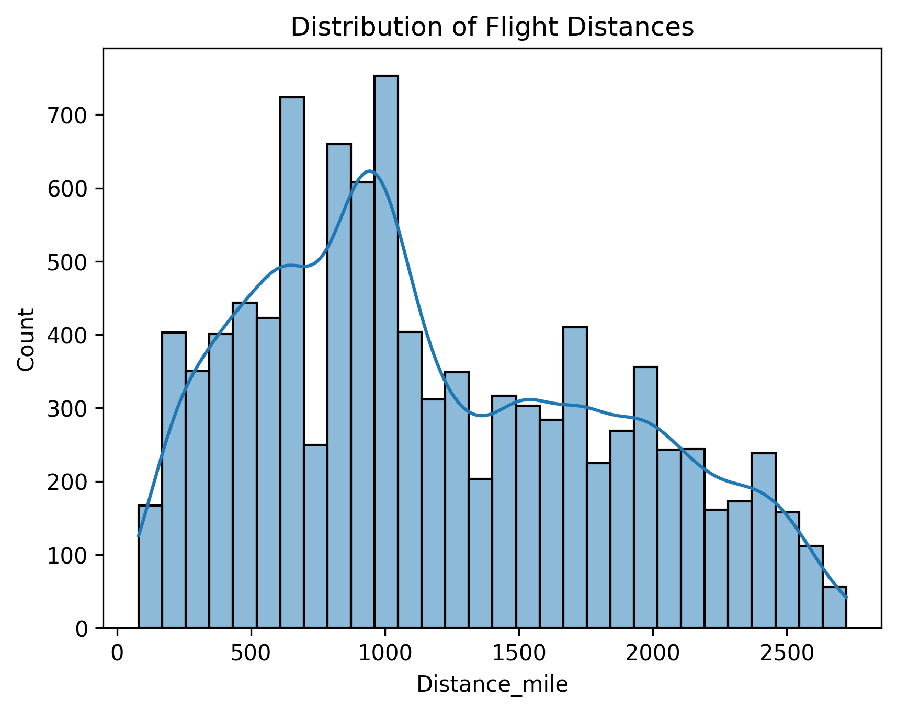
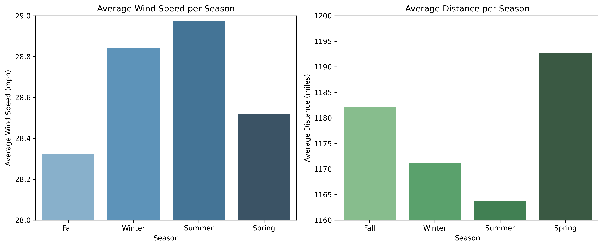
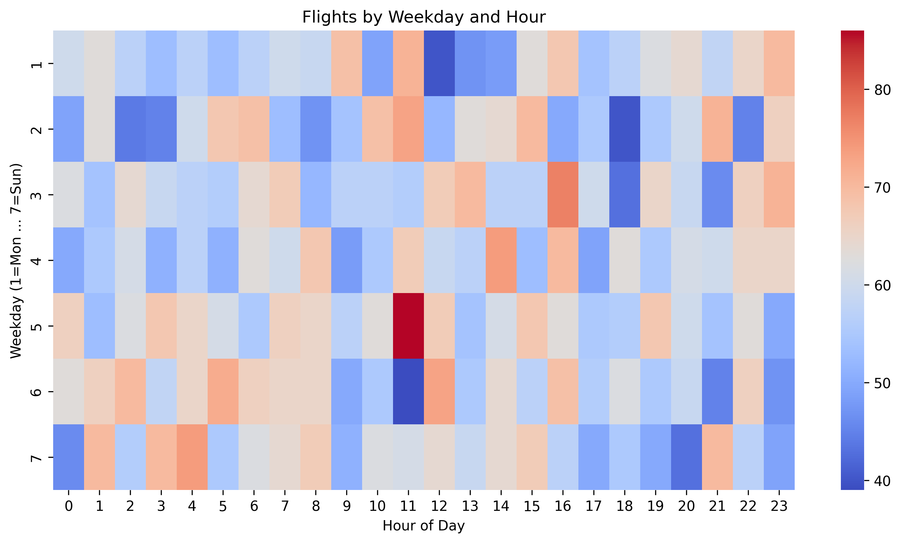

# Flight Data EDA

This repository contains a data analysis and visualization project exploring flight data, including flight distances, wind speed, turbulence, departure and arrival airports, and seasonal trends.

## Overview

The project performs exploratory data analysis (EDA) on flight datasets to understand patterns in:

- Flight distances
- Wind speed variations
- Turbulence levels
- Departure and arrival airport frequency
- Seasonal trends in flight activity
- Time-of-day patterns (morning, afternoon, evening, night)
- Weekday vs. hour correlations

Visualizations include:

- Histograms of flight counts by hour
- Count plots of flights by weekday
- Boxplots of wind speed and distance by turbulence level
- Heatmaps showing total flights by weekday, hour, and time of day, split by season
- Bar plots of average wind speed per season and average distance per weekday/season
- Top 10 departure and arrival airports mapped geographically with circle size and color indicating flight counts
### Flight Distance Distribution


### Average Distance per Season


### Flights Heatmap (Weekday vs Hour)



## Data

### Importing Data from Kaggle and Other Sources

1. **Weather Observations in Aviation Industry**  
   Source: [Kaggle Flight Data](https://www.kaggle.com/datasets/aadharshviswanath/flight-data)

2. **Global Airport Database**  
   For airport names and coordinates  
   Source: [Partow Airport Database](https://www.partow.net/miscellaneous/airportdatabase/)

> **Note:** All measurements in the datasets have been converted to the United States Customary system:
> - Wind speed in miles per hour (mph)  
> - Visibility in miles  
> - Temperature in Fahrenheit  
> - Distance in miles  

### Columns in the Dataset

| Column | Description |
|--------|-------------|
| Flight_ID | Unique flight identifier |
| Date | Date of the flight |
| Time | Scheduled departure time |
| Departure_Airport | Departure airport code |
| Arrival_Airport | Arrival airport code |
| Datetime | Combined date and time |
| Hour | Hour of the flight |
| Weekday_numeric | Numeric day of the week |
| Wind_Speed_knotstomph | Wind speed in mph |
| Visibility_km_tomile | Visibility in miles |
| Temperature_Celsius_toFahrenheit | Temperature in Fahrenheit |
| Season | Season of the flight (0=Winter, 1=Spring, 2=Summer, 3=Fall) |
| Turbulence_LeveltoNumerical | Turbulence level converted to numeric |
| Depart_Latitude / Depart_Longitude | Departure airport coordinates |
| Arrive_Latitude / Arrive_Longitude | Arrival airport coordinates |
| Distance_mile | Flight distance in miles |


## Key Insights

- Flight activity peaks in the **morning and night**, with lower activity in the afternoon and evening.
- **Flight distance distribution** is slightly right-skewed with a peak near 1000 miles.

- **Average wind speeds per weekday** range from **28.2 mph (Thursday)** to **29.0 mph (Friday)**, showing minor variations.
- **Average distance per weekday** ranges from **1150.8 miles (Thursday)** to **1197.2 miles (Sunday)**.
- **Average wind speeds per season**: Summer is highest (~28.99 mph), Fall lowest (~28.3 mph).  
- **Average distance per season**: Spring highest (~1193 miles), Summer lowest (~1163.7 miles).

- **Boxplots of turbulence vs wind speed**:  
  - Low turbulence (1): middle 29 mph, top 44 mph, bottom 15 mph; whiskers 0–58 mph.  
  - Medium turbulence (2): middle 29 mph, top 44 mph, bottom 14 mph; whiskers same as low turbulence.  
  - High turbulence (3): middle 28 mph, top 43 mph, bottom 15 mph; whiskers same as others.
- **Boxplots of turbulence vs distance**:  
  - Low turbulence: median ~1000 miles, top ~1700 miles, bottom ~600 miles.  
  - Medium turbulence: median ~1100 miles, top ~1800 miles, bottom ~600 miles.  
  - High turbulence: median ~1000 miles, top ~1800 miles, bottom ~600 miles.
- **Top 10 departure airports**: MCI, AUS, BNA, SAN, IAH (and others).
- **Top 10 arrival airports**: IND, DTW, MCO, DFW, LAX (and others).  


- **Heatmaps of flights by weekday and hour**:  
  - **Friday at 11 AM** has the most flights.  
  - Lowest flights occur on **Saturday at 11 AM**, **Tuesday at 6 PM**, and **Monday at 12 PM**. 


## Usage

1. Clone the repository:
```bash
git clone https://github.com/tiakorre/EDA_Flight_Data.git